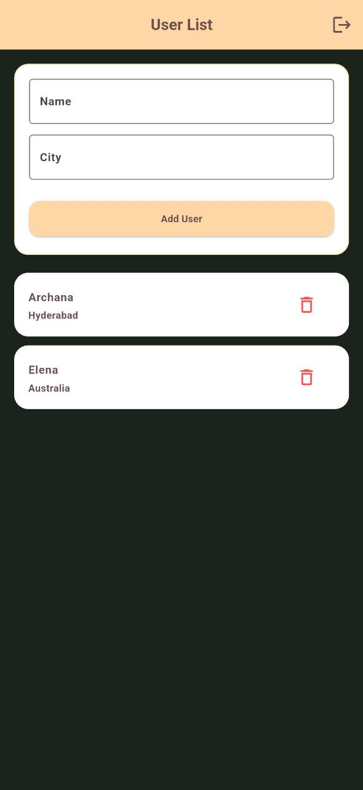
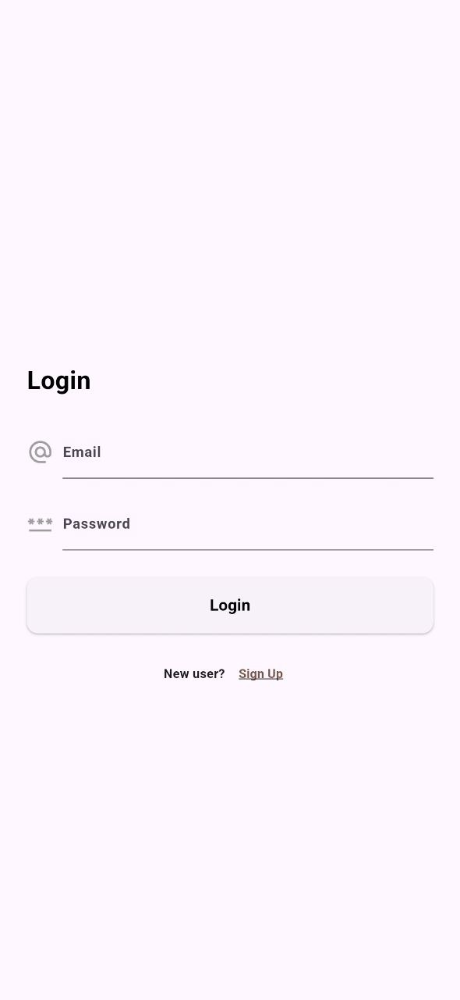
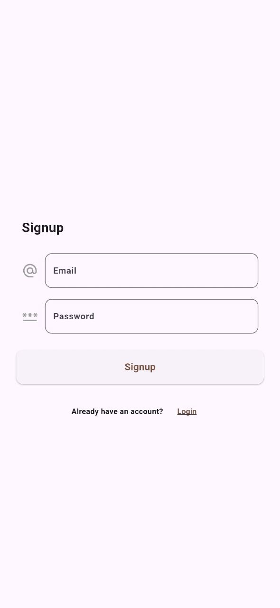

# untodo

A simple cross-platform Todo app built with Flutter and Firebase.

## Features

- User authentication (Sign up, Sign in, Sign out) using Firebase Auth
- Add, complete, and delete todo tasks
- Filter todos by All, Completed, or Pending
- Real-time sync with Firestore
- Responsive UI for mobile and web

## Getting Started

 **Set up Firebase:**
   - Create a new Firebase project.
   - Add your app to the Firebase project.
   - Download the `google-services.json` and `GoogleService-Info.plist` files and place them in the respective directories:
     - Android: `android/app/`
     - iOS: `ios/Runner/`
   - Enable Firebase Authentication and Firestore in the Firebase console.